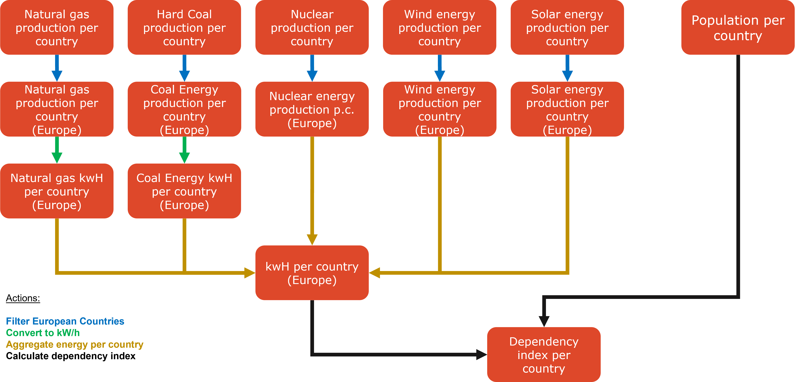

# Hands-on use case

## Case - Compute EU energy dependency index

The goal of this use-case is to calculate the energy production vs. consumption (avg. over the last 5 years) of each country in Europe in order to measure a rough dependancy KPI. In other words, we want to measure *how well a country can sustain its own energy needs*.

### Assumptions / Scope

For this, we make rough assumptions / use the following restrictions:
1. We only consider countries in Europe.
2. We only consider the top 5 energy sources. 
    1. natural gas
    2. coal and other fossil fuels
    3. nuclear
    4. wind
    5. solar
3. We use basic formulas to calculate the total kw/H that can be produced by each enery source. 
4. We assume that each person in the EU roughly needs the same amount of energy.
5. We calculate our own dependancy of a country x KPI with: 

$$ {dep_x} = {{\text{total energy needed per person}} \over {\text{total energy produced per person}}} \times 100 $$ 

### Steps

After manually downloading the data, the steps needed for the calculations would be:
1. Create one DataObject for each energy source per country.
2. Create a DataObject for the population of each country. 
3. Filter the countries in Europe
4. Calculate kW/h produced for each energy source in each country
5. Aggregate produced energy per country
6. Calculate needed energy (based on population) for each country
7. Produce dependency index for each country as an end result. 

## Backup Case 1: Computing possible distances to be traveled by e-vehicle

In this scenario, we consider a group of e-vehicles with different maximal traveling distances ranging from 1km to 50km. We want to be able to compute the following: starting from a charging station and assuming that we know where other charging stations are, "*what is the farthest point within a 100 km radius where each vehicle can travel*. In other words, we want to know how far each car can get assuming that it has to stop at another charging station after the maximum traveling distance has been reached.

## Backup Case 2: Measuring the efficiency of COVID-19 contact tracing systems in Switzerland

For this use case, we use two datasets: one of them holds the data for contact tracing cases, including the week and the place where COVID-19 was contracted by a person. The other dataset includes the total number of reported cases per week. We want to be able to answer the following:

1. Per season: Which activities where most common in order to get COVID-19?
2. Comparison: how effective was the tracing system in Switzerland compared to the total number of reported cases per week?

